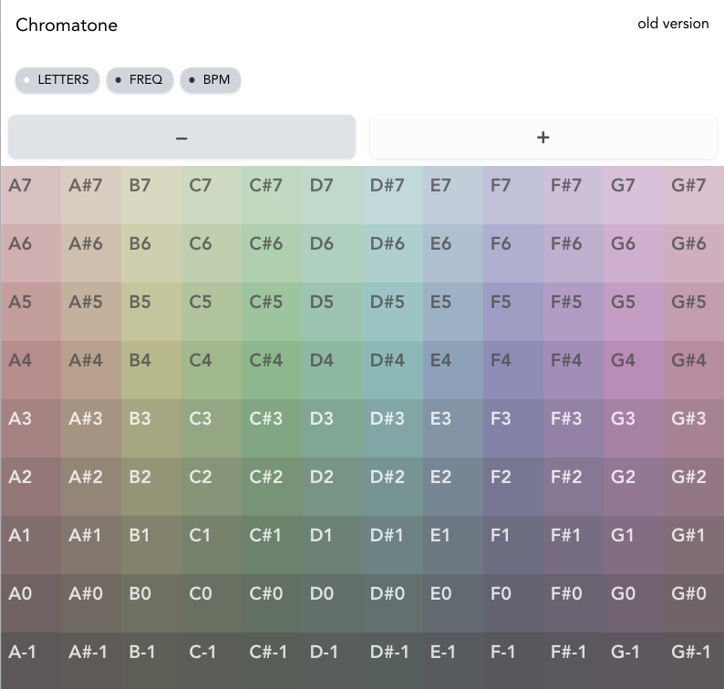

## Chromatone: pitch table

A table of playable pitches. Build with vite, vue 3, windicss and tone.js. Works in any desktop browser. Probably will work on mobile somehow. 😅

A video of me live coding this project is this playlist: https://www.youtube.com/watch?v=kJqpV-t1Bl0&list=PLncuCCb2zjt5odz9fX4pAjK2cevkg8F2i

### Road map

- Completed:
  - [x] stop sound on cell before unmounting it
  - [x] dark mode switch and basic styles
- Mobile:
  - [ ] fix: iOS - no sound
  - [ ] fix: Android - glitches
- Performace:
  - [ ] fix: too slow render
  - [ ] fix: noisy tones
- Features:
  - [ ] Synth controls
    - [ ] osc waveform
    - [ ] filter
    - [ ] ADSR
  - [ ] Scroll controls (?)
  - [ ] Intonation
  - [ ] A4 freq
